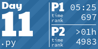
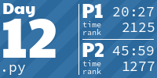
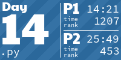
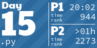
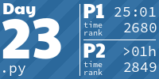

# Advent of Code 2024

My solutions for [Advent of Code](https://adventofcode.com/2024) in 2024. Probably done mostly in Python 3.13 🐍.

Keep in mind these are optimized solutions, not necessarily the one I used to solve the problem at first.

Rules:

- Python: No external libraries, only the standard library.
- Always a **general** solution, not just for the input. Any input should work.
- A short runtime. No brute force solutions.
- **No** AI-solutions used! 🙅🏽‍♂️ (Contrary to the global leaderboard)

Other:

- Automatic execution and submission via [`aocd`](https://github.com/wimglenn/advent-of-code-data) and [`watchexec`](https://watchexec.github.io/).
- `solutions/` contain the source files to solve the problem, one for each day. Executable via stdin to print both results. Keep in mind they are _cleaned_ solutions. I'd like to keep the two parts in separate functions, even though they might share code.
- Code is formatted with [`black`](https://github.com/psf/black).
- Tiles below are generated via [aoc-tiles](https://github.com/LiquidFun/aoc_tiles).

<!-- AOC TILES BEGIN -->
<h1 align="center">
  2024 - 22 ⭐ - Python
</h1>

<!-- AOC TILES END -->